# FnDevCS
A workshop for working with Oracle Developer Cloud and Project Fn

Access your DevCS instance at - https://devcs-gse00014338.developer.ocp.oraclecloud.com/devcs-gse00014338

# Create a DevCS Project
Create a new Project in Developer Cloud Service (DevCS) - use your name in the project name "ShayFn"
  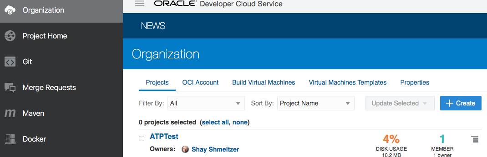
 Choose to create a project with an initial repository (this will create an empty git repository - keep the readme file in the next wizard step)
  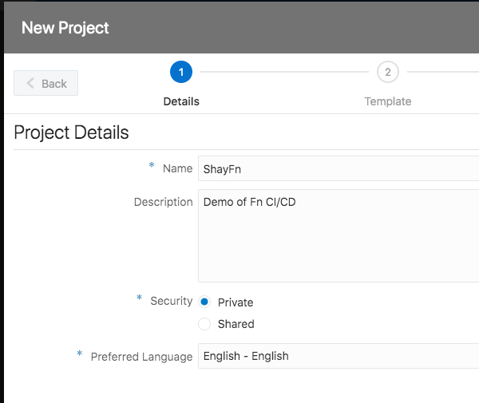
  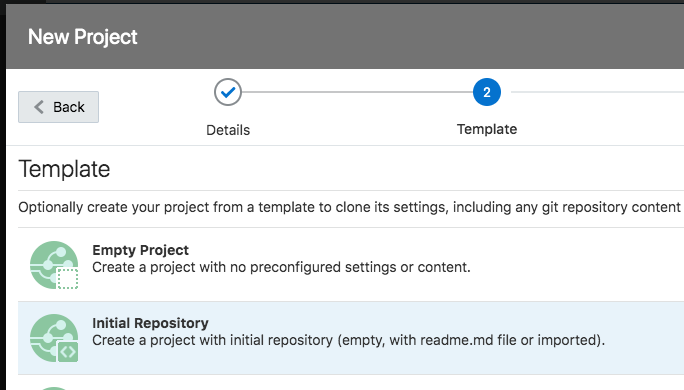
 On the right side of the project home page in the repositories tab, click the clone button for your git repository and copy the URL for the https connection.
  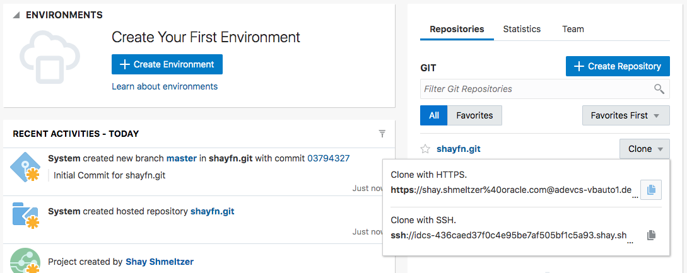

# Create a function and push to git
Open a terminal window on your machine (or go to the command line)
1. 
1. Clone the git repository to your machine:
1. Git clone (paste-the path)
1. When prompted to login provide the password for your account
1. Once the clone has completed cd into the new directory
      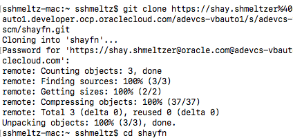
1. Create a new function in the directory using:
     fn init --runtime go DevCSFn 
      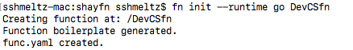
1. This creates a function that you can now push into the git repository
1. Add the new files : git add . -A
1. Commit the code using : git commit -m "initial version"
1. Push the code into DevCS : git push
      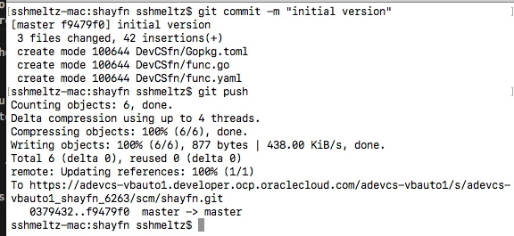

 Your code is now in the cloud - switch back to your browser and navigate to the git section to see it.
      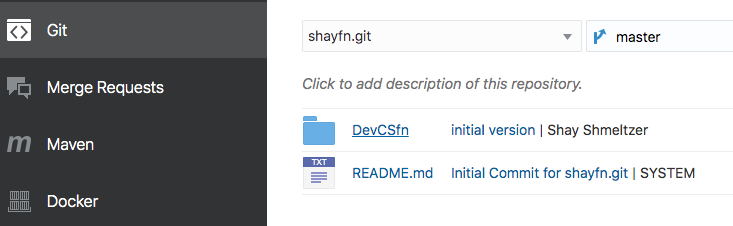
    
# Creating A Build Job
Next we are going to create build job that will publish our Fn function to the Functions Service
 

1. In DevCS click te Build tab, and click to create a new build - give it a name "Fn CICD" and choose the default VM template
      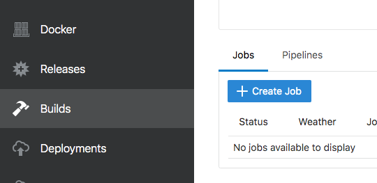
      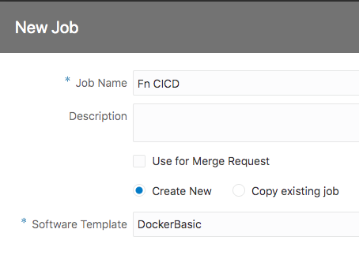
1. In the Git tab click "add source control" to add your Git repository and point it to the master branch of your git repo.
1. Check the "Automatic" check box so the build will be invoked each time code changes in the master branch
      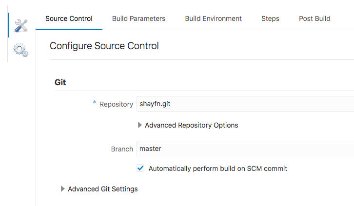
1. Switch to the Steps tab and create a new Step using a Docker->Login operation
1. Provide the registry into which the function docker image will be published - phx.ocir.io
1. For user use the OCI user, and for password provide the auth token for that user
 (You can find this information on your compute -> users section choosing the auth key on the right menu)
      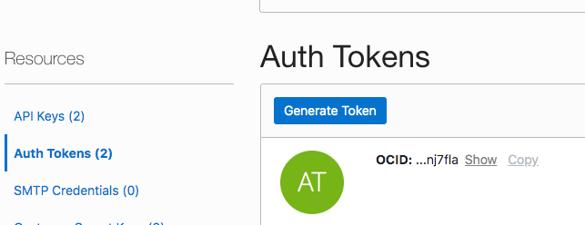

Next add an OCIcli step to configure your OCI environment 
 (you can find most of this information in your compute->users section with API Keys selected on the left
 If you don't have a signing key use the steps here - https://www.oracle.com/webfolder/technetwork/tutorials/infographics/oci_faas_gettingstarted_quickview/functions_quickview_top/functions_quickview/index.html# )
      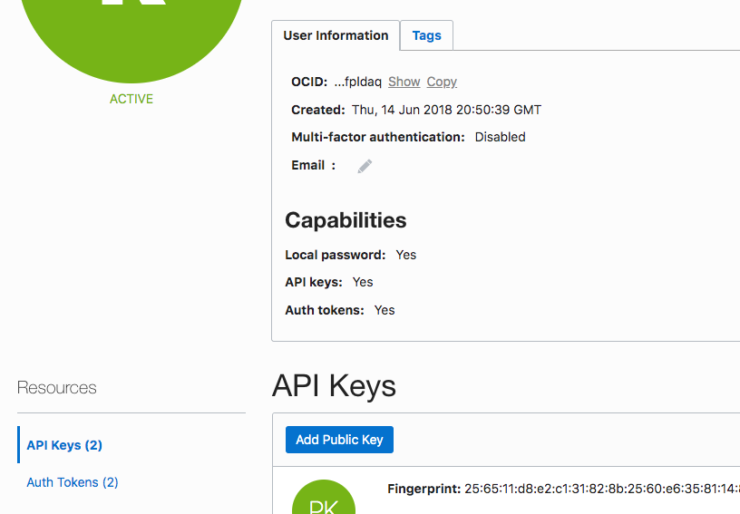
      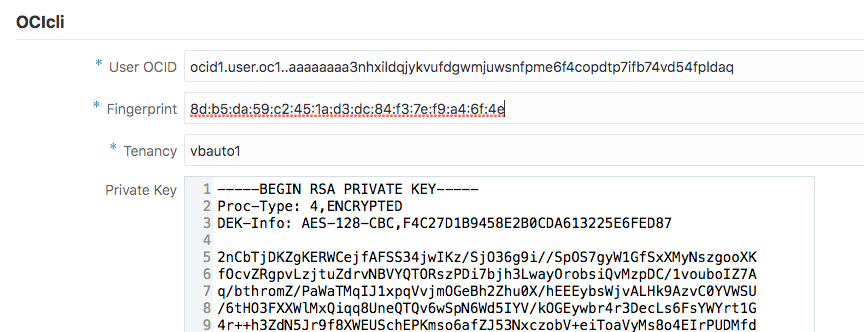
 Due to a little bug we now need to add a shell script step that will change the priviliges on the OCI config files. Use the following line:
 chmod 777 /home/builder/.oci/config 
      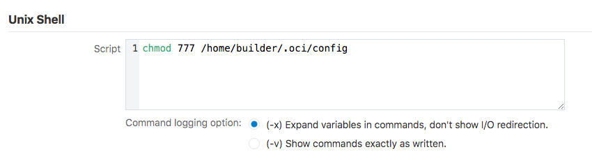
    
 Now add an Fn->Fn OCI step 
 The information about the compartment id is in the "Getting started" section of the app you created on FaaS
      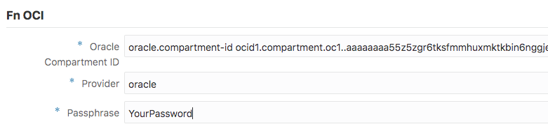
 Add an Fn->Fn Build step
 Fill in the registry host phx.ocir.io , and the user (same as in step 1 of the build)
      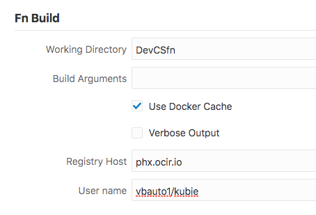
 Add an Fn->Fn Deploy step 
 Fill in the name of the app you created in previous labs, the registry host, user name, 
    and the api URL (which is available on the app Getting Started Tab)
      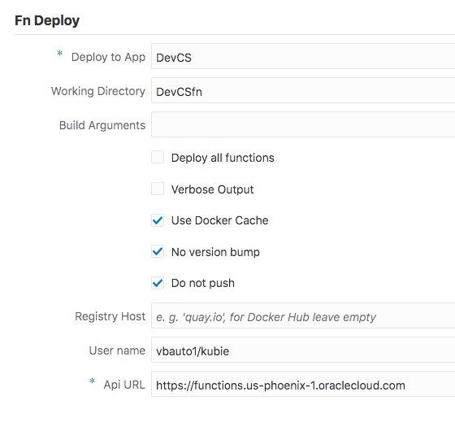
 Now click Save and then Run the Build, You can monitor the execution through the login

 If everything worked as expected your new function should now appear in your application

Now try and modify the function code, back in the git tab, navigate to the function *.go file, click the pencil to go into edit mode.
Change the message that is presented from the function, when done with the change click the commit button - provide a commit message

Back in the build tab you should now see a new build job queued to execute. It will deploy the updates you did to your code to the FaaS.

#Advance Steps

#Working with issues
1. Click the Issues tab on the right side menu
1. Create a couple of issues in your system
1. Click the boards tab on the right side menu
1. Create a new SCRUM board
1. Create a new Sprint
1. Drag issues from the backlog to the new sprint
1. Start the new Sprint
1. Change the status of an issue in the board

#Working with branches (GitFlow)
1. In the git tab switch to the "Refs" section (at the top right)
1. Click the "Create Branch"
1. Call it fix1
1. Fix code in your function in the branch (click the pencil to edit the file and then commit)
1. Click Merge Requests in the right side menu
1. Create a new Merge request
1. Fill the details to merge into master your branch code. In the second step - type 1 in the issues to hook the fix to your issue.
1. View your merge request, check the changed files tab, provide a comment by clickin on the change line of code
1. Approve the change, and click merge to merge your changes into the main branch.
